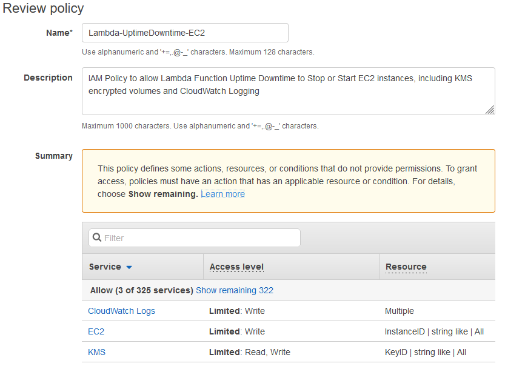
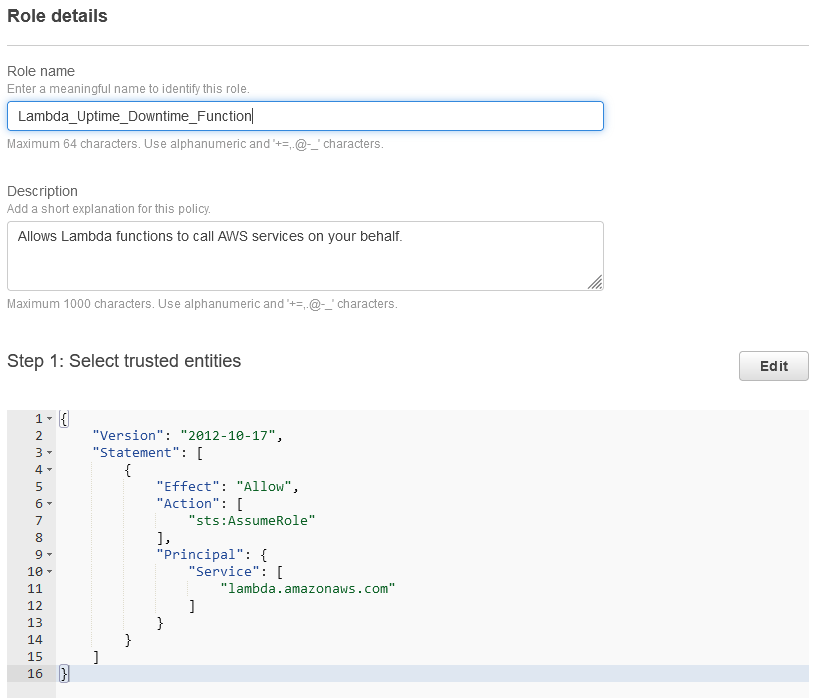
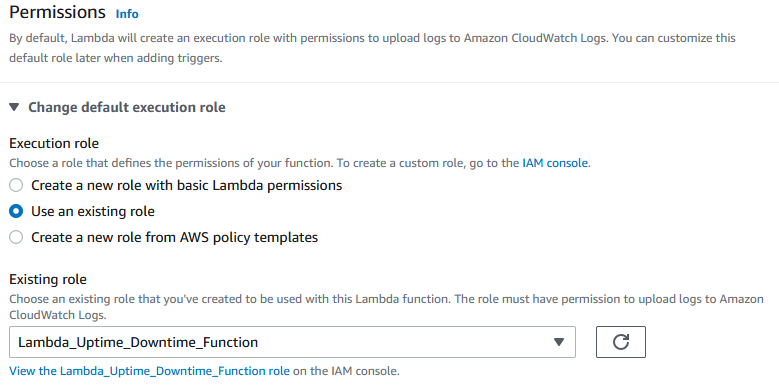
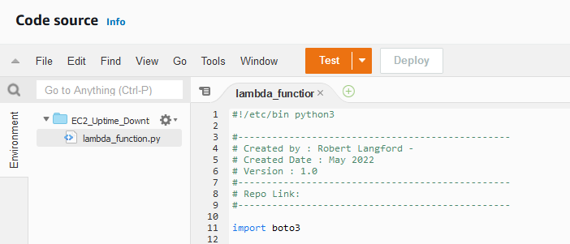
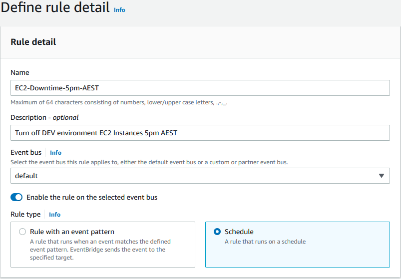
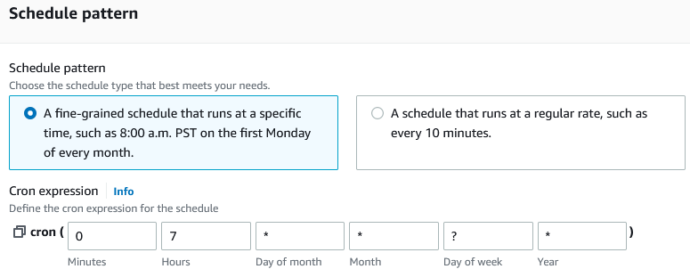
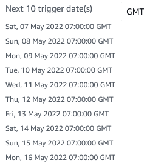
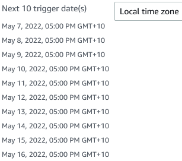
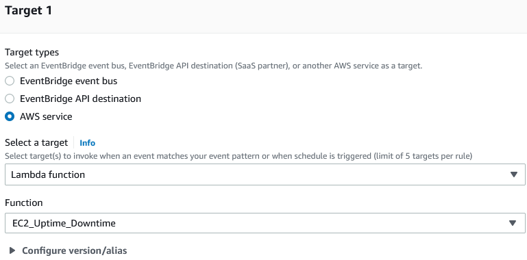
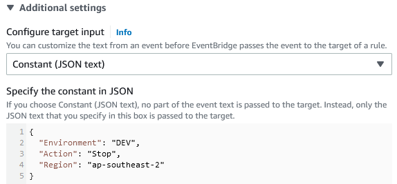

# AWS EC2 Uptime/Downtime scheduler

   

## Description

This is a simple uptime/downtime lambda script written in Python using Boto3 for AWS EC2 that I've developed. It's written to ensure that Non-Production systems/instances are not left running out side of business hours and weekends.
The application of this can be applied to ensure that systems are started in the morning and therefore available for developers. Or you can simply set up to turn off the systems at the end of the day.

---

## Table of Contents

* [How this works](#how-this-works)
* [Components](#components)
  * [AWS EventBridge Rule](#aws-eventbridge-rule)
  * [AWS Lambda](#aws-lambda)
  * [AWS KMS](#aws-kms)
* [How to deploy](#how-to-deploy)
  * [Manual Deploy](#manual-deploy)
    * [IAM Role](#iam-role)
      * [Policy](#policy)
      * [Role](#role)
    * [Lambda](#lambda)
    * [EventBridge](#eventbridge)
  * [Terraform](#terraform)
  * [Cloudformation](#cloudformation)
* [How to use](#how-to-use)

---

### How this works

An [AWS Lambda](https://aws.amazon.com/lambda/) will contain a simple Python script that uses [Boto3](https://boto3.amazonaws.com/v1/documentation/api/latest/index.html) to Stop and Start AWS EC2 Instances. This is controlled using an [AWS EventBridge Rule](https://docs.aws.amazon.com/eventbridge/latest/userguide/eb-rules.html) to schedule the events using a cron expression to trigger the AWS Lambda to run the Python script.

<div style="margin-left: auto;
            margin-right: auto;
            width: 50%">


</div>

#### Components

##### AWS EventBridge Rule

AWS EventBridge is a serverless event bus service that allows you simply connect applications and data. This was originally called CloudWatch Events, as this has continued to grow it has become its own Service. We will simply be using a Rule that is triggered on a Schedule. You can however setup an event trigger, for example a webhook to start a development environment from Slack or Microsoft Teams.

##### AWS Lambda

AWS Lambda is a simple serverless service that allows developers to run code without having to worry about provisioning or managing Infrastructure or scaling. Compute costs are calculated based on the memory and per-millisecond execution of the code. Because the costs are based on how long the code takes to execute I haven't included any wait conditions or long process loops, for this process it is a waste of operational overhead to include these.

##### AWS KMS

AWS Key Mangement Service is only required if you have encrypted the EC2 Instance Volume. The AWS Lambda will need access to the key in order to decrypt the volume during startup.

---

### How to Deploy

This project can be quickly deployed manually to ensure you have full understanding of this process, if you want to fully understand all of the components being used. If you are looking to deploy this at scale however I would recommend using the Infrastructure as Code options provided once you have reviewed the details of how it works.

#### Manual Deploy

Pre-requisit: This script is designed to target a specific environment based on the EC2 Instance having an instance tag of "Environment" with a value that matches the value specified passed in using the EventBridge rule content.

##### IAM Role

###### Policy

* Log into AWS Console and open **IAM**.
* Select **Policies**, **Create Policy** and **JSON**.
* Open the file [AWS-IAM-Policy.json](AWS-IAM-Policy.json) and replace the \<AccountID> with your AWS Account Id.
* Paste the resulting details and replace the default contents.
* Select **Next: Tags**, Add any relevant tags or **Next: Review** and enter the details.

<div style="margin-left: auto;
            margin-right: auto;
            width: 40%">


</div>

###### Role

* Select **Roles**, **Create Role**, Trust Entity type **AWS Service**, Use Case: **Lambda** and click **Next**.
* From Add Permissions check the previous created Policy and click **Next**.
* Finally enter the Role details and click **Create Role**.

<div style="margin-left: auto;
            margin-right: auto;
            width: 40%">


</div>

##### Lambda

* Search AWS Console or Select **Lambda**
* Click **Create Function**
* Select **Author from Scratch**, enter the following details:
  * **Function Name:** *EC2_Uptime_Downtime*
  * **Runtime:** *Python 3.9* (Currently the latest Available)
  * Click **Change default execution role**, select **Use an existing role**, select the role created earlier from the dropdown and finally click **Create function**

<div style="margin-left: auto;
            margin-right: auto;
            width: 40%">


</div>

* Under **Code Source** select *lambda_function.py* and replace the code with [aws_lambda_stop_start.py](./aws_lambda_stop_start.py) provided.

<div style="margin-left: auto;
            margin-right: auto;
            width: 40%">


</div>

* Select **Deploy** to save the changes.

##### EventBridge

First thing we are going to create is the Downtime trigger, this is important to makesure that all of the instances are turned off at the end of the day.
This is entirely based on your use case however even if you are a Mon-Fri 9-5pm business you may have developers working on the weekends or someone may start instances after hours for maintenance. So having a stop at 5pm and midnight will stop these without being disruptive.
Cron expression rules are run based on UTC/GMT time in AWS, so you will need to convert your local timezone to UTC/GMT. For me I am based in the East coast of Australia AEST +10 UTC/GMT, so I need to account for this. Also be aware that UTC/GMT is unaffected by Daylight Savings, if your timezone does observe this either build +/- 1hour into your timings or makesure to correct this when time changes occur in your timezone.

* Search AWS Console services or Select **EventBridge**
* Select **Rules**
* Enter Rule details, select **Schedule** and **Next**

<div style="margin-left: auto;
            margin-right: auto;
            width: 40%">


</div>

* Define schedule pattern, for me the cron expression is (07\*\*\?\*) - at minute 0, at 7am, every day, every month, every day of the week, every year.

<div style="margin-left: auto;
            margin-right: auto;
            width: 40%">


</div>

* the next 10 trigger events are shown, you can select the dropdown to compare this to your local timezone to confirm its as you expect and click **Next** to continue.

<div style="margin-left: auto;
            margin-right: auto;
            width: 40%">

| GMT | AEST |
|-----|------|
| | 
</div>

* Now to select the Target type, click **AWS Service**, click the dropdown and select *EC2_Uptime_Downtime* and Additional Settings.

<div style="margin-left: auto;
            margin-right: auto;
            width: 40%">


</div>

* The following settings are specific to your deployments, in this case my EC2 Instance is deployed into the region *ap-southeast-2* and has an Environment tag with the Value DEV for development. Click the dropdown below **Configure target input** and select **Constant (JSON) text.

<div style="margin-left: auto;
            margin-right: auto;
            width: 40%">


</div>

* Paste the following JSON blob and fill your specific details.

<div style="margin-left: auto;
            margin-right: auto;
            width: 30%">

```json
{
  "Environment": "DEV",
  "Action": "Stop",
  "Region": "ap-southeast-2"
}
```

</div>

* To finish click **Next**, **Next**, and **Create Rule**

#### Terraform

(Current work in progress.)
Working on a simple Terraform deployment for ease of deployment.

* [Terraform](./uptime_downtime/terraform/README.md) - Terraform code to deploy AWS EC2 Uptime/Downtime scheduler

#### CloudFormation

* Coming once Terraform is built out.
