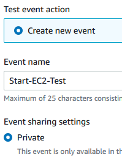
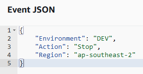

# AWS EC2 Uptime/Downtime scheduler

    

## Description

This is a simple uptime/downtime lambda script written in Python using Boto3 for AWS EC2 that I've developed. It's written to ensure that Non-Production systems/instances are not left running out side of business hours and weekends.
The application of this can be applied to ensure that systems are started in the morning and therefore available for developers. Or you can simply set up to turn off the systems at the end of the day.

---

## Table of Contents

* [How this works](#how-this-works)
* [Components](#components)
* [How to deploy](#how-to-deploy)
  * [Manual Deploy](#manual-deploy)
  * [Terraform](#terraform)
  * [Testing](#testing)

---

### How this works

An [AWS Lambda](https://aws.amazon.com/lambda/) will contain a simple Python script that uses [Boto3](https://boto3.amazonaws.com/v1/documentation/api/latest/index.html) to Stop and Start AWS EC2 Instances. This is controlled using an [AWS EventBridge Rule](https://docs.aws.amazon.com/eventbridge/latest/userguide/eb-rules.html) to schedule the events using a cron expression to trigger the AWS Lambda to run the Python script.

<div style="margin-left: auto;
            margin-right: auto;
            width: 50%">


</div>

#### Components

##### AWS EventBridge Rule

AWS EventBridge is a serverless event bus service that allows you simply connect applications and data. This was originally called CloudWatch Events, as this has continued to grow it has become its own Service. We will simply be using a Rule that is triggered on a Schedule. You can however setup an event trigger, for example a webhook to start a development environment from Slack or Microsoft Teams.

##### AWS Lambda

AWS Lambda is a simple serverless service that allows developers to run code without having to worry about provisioning or managing Infrastructure or scaling. Compute costs are calculated based on the memory and per-millisecond execution of the code. Because the costs are based on how long the code takes to execute I haven't included any wait conditions or long process loops, for this process it is a waste of operational overhead to include these.

##### AWS KMS

AWS Key Mangement Service is only required if you have encrypted the EC2 Instance Volume. The AWS Lambda will need access to the key in order to decrypt the volume during startup.

---

### How to Deploy

This project can be quickly deployed manually to ensure you have full understanding of this process, if you want to fully understand all of the components being used. If you are looking to deploy this at scale however I would recommend using the Infrastructure as Code options provided once you have reviewed the details of how it works.

#### Manual Deploy

[Uptime Downtime - How to Deploy](https://github.com/roblangford/aws-ops/blob/main/uptime_downtime/README.md#how-to-deploy)

#### Terraform

The code has been tested and working on the Terraform Version 1.1.9 and AWS Provider hashicorp/aws v4.13.0

##### Variable Inputs

variable "region" - this is a string input to denote where to deploy the resources (default: ap-southeast-2)  
variable "aws_account_id" - number input for AWS Account ID  
variable "lambda_function_name" - Input a name to identify your AWS Lambda Function. (default: uptime_downtime_function)  
variable "target_environment" - Input a target Environment tag to execute against. (default: DEV)  
variable "enable_cloudwatch_logging" - Set to True to enable CloudWatch Logging.  (default: true)  
variable "lambda_cloudwatch_log_retention" - Input a number of days to store CloudWatch Logs. (default: 14)  
variable "enable_eventbridge_rule_stop_ec2" - Set to True and the other scheduled stop variables to create EventBridge Rule (default: false) 
variable "scheduled_stop_hour" - Enter the UTC hour that you wish to Stop the EC2 Instances. (default: 17)  
variable "scheduled_stop_minute" - Enter the Minute that you wish to Stop the EC2 Instances. (default: 0)  
variable "enable_eventbridge_rule_start_ec2" - Set to True and the other scheduled start variables to create EventBridge Rule (default: false)  
variable "scheduled_start_hour" - Enter the UTC hour that you wish to Start the EC2 Instances. (default: 8)  
variable "scheduled_start_minute" - Enter the Minute that you wish to Start the EC2 Instances. (default: 0)  

The input variables for EventBridge Rules are used to generate cron expressions for schedules. All times are based on GMT/UTC and should be input in 24 hour format.
e.g.: Brisbane AEST is +10 hours to stop instances at 5pm you would set scheduled_stop_hour to 7

##### Testing
If you wish to perform testing from the AWS Console simply open the Lambda Function, select the Uptime Downtime Function and the Test tab.
You can now Create a new event, set the name e.g. : Start-EC2-Test

<div style="margin-left: auto;
            margin-right: auto;
            width: 50%">





</div>
JSON code example
```JSON
{
  "Environment": "DEV/UAT/PRD",
  "Action": "Stop/Start",
  "Region": "ap-southeast-2"
}
```
